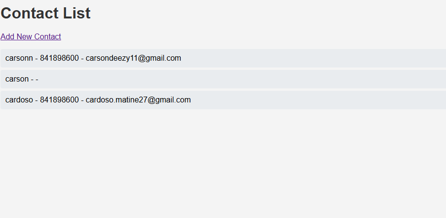

# Django Contact Manager

A simple contact registration project built with **Django** and **MySQL**, featuring a basic front-end and Django Admin interface for contact management.

##  Features

- Register new contacts
- View contact list via Admin Panel
- Basic front-end UI with form styling
- MySQL database integration

##  Technologies

- Python 
- Django 
- MySQL 
- HTML + CSS
